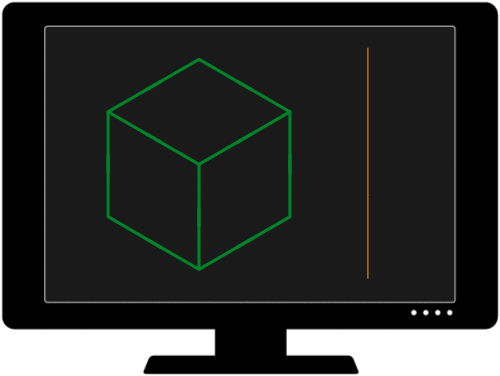

<h1 align="center"><a href="#">&#x200B;</a>Welcome to My Matrix!</h1>
<h3 align="center"><a href="#">&#x200B;</a>I believe every great idea deserves to be brought to life,  and that's why I love what I do—turning ideas into reality.</h3>

### [&#x200B;](#)<ins>Tech Stack</ins>

)
 

 

 

 

                                                                                                   
## [&#x200B;](#)Get in touch with me

